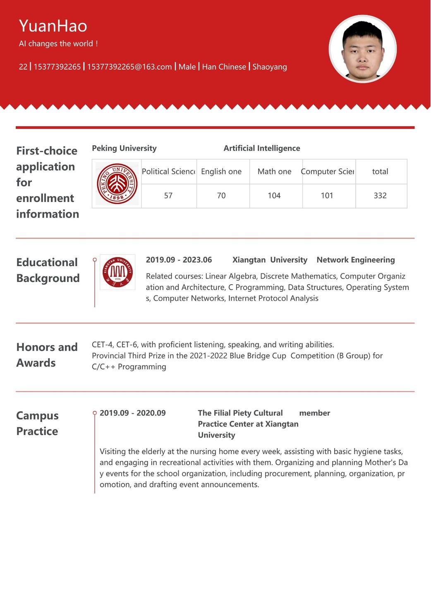
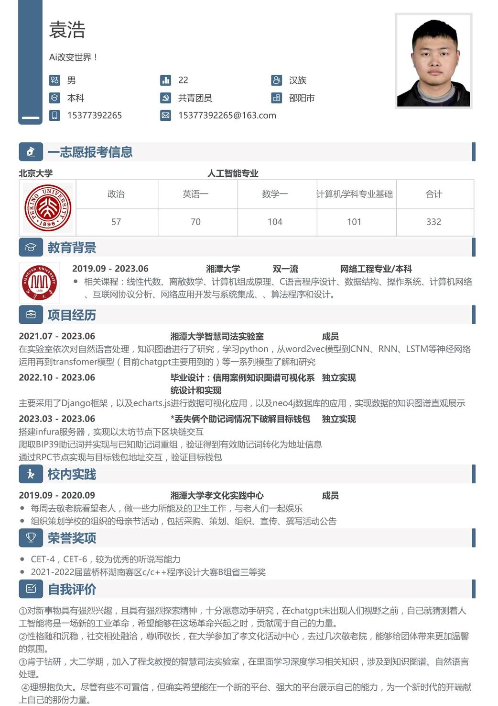

<!DOCTYPE html>
<html>
<head>

    <title>我的个人简介（中英文版）</title>
</head>
<body>
    

    <h1>袁浩个人简历英文版</h1>
    

    

    
    

    

    
    

    

    <h1>袁浩个人简历中文版</h1>
    

    

    
    

</body>
</html>
